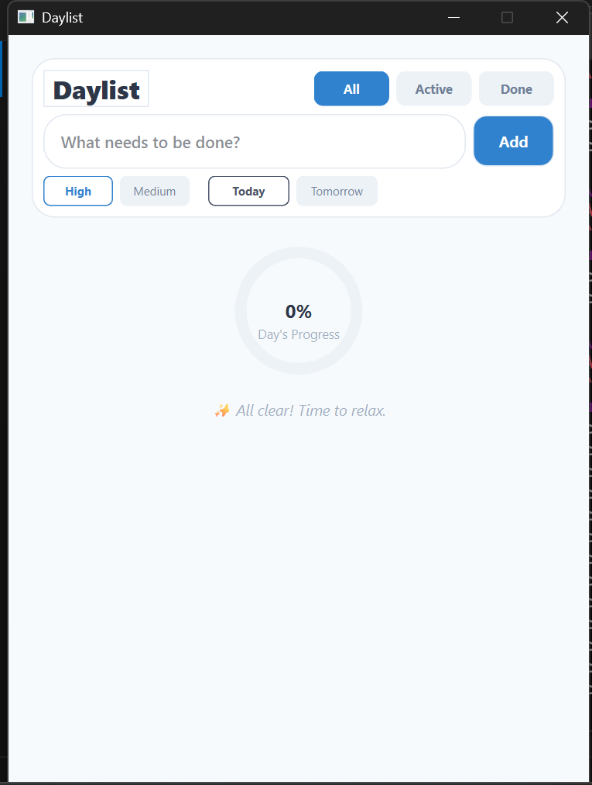
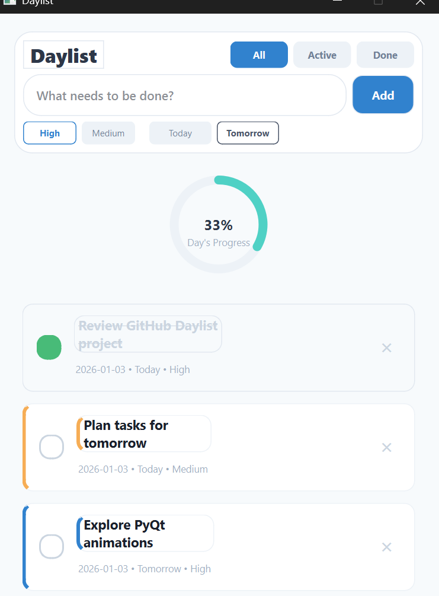

# Daylist — Daily Task Manager

Daylist is a desktop to-do application built with **Python & PyQt6**, designed to help users manage daily tasks with a clean interface, smooth interactions, and clear progress tracking.

---

## Features

- Add, complete, and delete tasks
- Task filters: **All / Active / Done**
- Priority levels: **High / Medium**
- Due dates: **Today / Tomorrow**
- Animated circular daily progress indicator
- Undo delete action
- Bulk actions (Finish selected / Remove tasks)
- Keyboard support (Enter & Delete)
- Accessible focus states & tooltips

---

## Screenshots

### Main Interface

### Tasks & Progress

---

## Tech Stack

- Python 3
- PyQt6
- Qt StyleSheet (QSS)
- QPropertyAnimation
